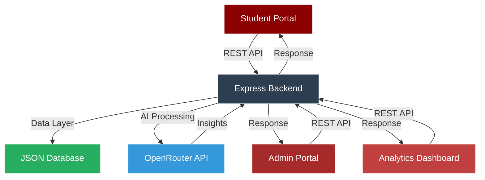

# Amrita Placement Tracker

<div align="center">


### **Next-Generation Campus Placement Management System**

*Streamlining placement tracking with AI-powered insights and analytics*

[Features](#features) • [Tech Stack](#tech-stack) • [Installation](#installation) • [Documentation](#documentation) • [Team](#team)

---


</div>

## Overview

**Amrita Placement Tracker** is an enterprise-grade, full-stack web application engineered to revolutionize campus placement management at Amrita Vishwa Vidyapeetham. Built for the Career & Internship Readiness (CIR) team and students, this platform delivers centralized tracking, advanced analytics, and AI-driven insights to optimize placement outcomes.

<details>
<summary><b>View System Architecture</b></summary>



</details>

---

## Key Capabilities

<table>
<tr>
<td width="50%">

### Student Experience
- **Smart Dashboard** - Real-time placement status and metrics
- **Drive Discovery** - AI-matched company opportunities
- **Application Tracking** - Multi-stage interview progress
- **Skill Analysis** - Gap identification and recommendations
- **Resource Hub** - Curated preparation materials
- **Alumni Insights** - Previous placement data and trends

</td>
<td width="50%">

### Administrative Control
- **Bulk Operations** - CSV/Excel student data import
- **Drive Management** - Company and eligibility configuration
- **Status Updates** - Real-time application and offer tracking
- **Analytics Engine** - Comprehensive placement statistics
- **Report Generation** - Exportable insights (JSON/CSV/PDF)
- **Announcement System** - Broadcast notifications

</td>
</tr>
</table>

---

## Feature Matrix

| Category | Features | Status |
|----------|----------|--------|
| **Authentication** | Role-based access (Student/Admin), JWT tokens, Session management |  |
| **Placement Tracking** | Drive listings, Application management, Interview rounds, Offer tracking |  |
| **AI Integration** | Readiness scoring, Skill gap analysis, Company matching, Resource recommendations |  |
| **Analytics** | Department stats, CTC analysis, Placement trends, Exportable reports |  |
| **Data Management** | Bulk upload, Data validation, Export capabilities, Backup system |  |
| **UI/UX** | Responsive design, Dark mode, Animations, Professional theme |  |

---

## Technology Stack

<div align="center">

### Frontend Architecture


### Backend Infrastructure


### Data & Storage


</div>

---

## System Architecture

<details>
<summary><b>Component Breakdown</b></summary>

```
├── Frontend Layer    
│   ├── Student Portal
│   │   ├── Dashboard (Real-time stats, notifications)
│   │   ├── Drives (Browse, filter, apply)
│   │   ├── Applications (Track status, rounds)
│   │   ├── Profile (CGPA, skills, resume)
│   │   ├── Resources (Prep materials, guides)
│   │   └── Analytics (Personal insights)
│   │
│   ├── Admin Portal
│   │   ├── Dashboard (System overview, metrics)
│   │   ├── Students (Bulk upload, management)
│   │   ├── Drives (Create, edit, close)
│   │   ├── Applications (Review, update status)
│   │   ├── Analytics (Department, company stats)
│   │   └── Reports (Generate, export)
│   │
│   └── Shared Components
│       ├── Navigation
│       ├── Forms & Inputs
│       ├── Charts & Graphs
│       ├── Tables & Lists
│       └── Modals & Dialogs
│
├── Backend Layer
│   ├── Authentication Service
│   ├── Student Management
│   ├── Drive Management
│   ├── Application Processing
│   ├── Analytics Engine
│   ├── AI Integration
│   └── Report Generator
│
└── Data Layer
    ├── data.json (Primary storage)
    ├── Validation schemas
    └── Backup mechanisms
```

</details>

---

## AI-Powered Features

The platform leverages **OpenRouter API** for intelligent insights:

<table>
<tr>
<td width="33%">

#### Readiness Scoring
- Multi-factor analysis (CGPA, skills, experience)
- Weighted scoring algorithm
- Trend-based predictions
- Actionable recommendations

</td>
<td width="33%">

#### Skill Gap Analysis
- Company requirement matching
- Competency assessment
- Learning path generation
- Resource mapping

</td>
<td width="33%">

#### Smart Matching
- Student-company compatibility
- Role suitability scoring
- Historical success patterns
- Personalized suggestions

</td>
</tr>
</table>

---

## Analytics Dashboard

<details>
<summary><b>Available Metrics & Reports</b></summary>

### Placement Statistics
- **Overall Rate**: Placed vs Total Students
- **Department Breakdown**: CSE, ECE, EEE, ME performance
- **Company Analysis**: Drives, offers, acceptance rates
- **Timeline View**: Month-wise placement trends

### Compensation Analysis
- **CTC Distribution**: Histogram and percentile views
- **Range Analysis**: Min, Max, Median, Average
- **Company Comparison**: Offer packages across companies
- **Department Benchmarks**: Average CTC by department

### Student Insights
- **CGPA Correlation**: Academic performance vs placement
- **Skill Mapping**: In-demand vs acquired skills
- **Application Success**: Conversion rates by stage
- **Interview Performance**: Round-wise success metrics

### Export Formats
- JSON (Raw data)
- CSV (Spreadsheet compatible)
- PDF (Formatted reports)
- Excel (Advanced analytics)

</details>

---

## Project Structure

```plaintext
APT/
├── client/                     # Frontend (React + Vite)
│   ├── public/                 # Static assets
│   ├── src/
│   │   ├── assets/             # Images and global resources
│   │   ├── components/         # Reusable UI components
│   │   │   ├── admin/          # Admin-specific components
│   │   │   ├── Navbar.jsx
│   │   │   ├── NotificationsPanel.jsx
│   │   │   └── ...
│   │   ├── context/            # Global state (AuthContext)
│   │   ├── pages/
│   │   │   ├── admin/          # Admin Views
│   │   │   │   ├── Dashboard.jsx
│   │   │   │   ├── AdminAnalytics.jsx
│   │   │   │   ├── AdminAnnouncements.jsx
│   │   │   │   └── ...
│   │   │   ├── student/        # Student Views
│   │   │   │   ├── Dashboard.jsx
│   │   │   │   ├── PlacementDrives.jsx
│   │   │   │   ├── Profile.jsx
│   │   │   │   └── ...
│   │   │   ├── Home.jsx
│   │   │   ├── Login.jsx
│   │   │   └── Register.jsx
│   │   ├── App.jsx             # Main Routing
│   │   └── main.jsx            # Entry point
│   ├── .env                    # Frontend environment variables
│   ├── package.json            # Frontend dependencies
│   ├── tailwind.config.js      # Styling configuration
│   └── vite.config.js          # Build configuration
│
├── server/                     # Backend (Node.js + Express)
│   ├── controllers/            # Logic for handling requests
│   ├── models/                 # Mongoose Database Schemas
│   │   ├── User.js
│   │   ├── PlacementDrive.js
│   │   ├── Notification.js
│   │   ├── Application.js
│   │   └── ...
│   ├── routes/                 # API Route Definitions
│   │   ├── authRoutes.js
│   │   ├── studentRoutes.js
│   │   ├── adminRoutes.js
│   │   └── ...
│   ├── middleware/             # Auth & Error handling middleware
│   ├── .env                    # Backend environment variables
│   ├── package.json            # Backend dependencies
│   └── server.js               # Server entry point
│
├── .gitignore
├── README.md                   # Project Documentation
└── docker-compose.yml          # Container orchestration (optional)
```

---

## Sample Dataset

The system manages **65 students** from Amrita Vishwa Vidyapeetham:

```javascript
// Register Number Format
CB.SC.U4CSE22801 → CB.SC.U4CSE22865

// Data Structure
{
  "registerNumber": "CB.SC.U4CSE22801",
  "firstName": "Student Name",
  "lastName": "Last Name",
  "email": "student@example.com",
  "department": "CSE",
  "batch": "2026",
  "cgpa": 8.5,
  "backlogs": 0,
  "skills": ["React", "Node.js", "Python"],
  "placementStatus": "not_placed",
  "applications": [],
  "mockInterviews": [],
  "readinessScore": 0
}
```

<details>
<summary><b>View Complete Schema</b></summary>

```json
{
  "students": [
    {
      "id": "unique-id",
      "registerNumber": "CB.SC.U4CSE22801",
      "personalInfo": {
        "firstName": "string",
        "lastName": "string",
        "email": "string",
        "phone": "string",
        "dateOfBirth": "ISO-date"
      },
      "academicInfo": {
        "department": "CSE|ECE|EEE|ME",
        "batch": "2026",
        "cgpa": 0.0,
        "percentage": 0.0,
        "backlogs": 0,
        "semester": 8
      },
      "placementInfo": {
        "status": "not_placed|in_process|placed",
        "offeredCompany": "string|null",
        "offeredCTC": 0,
        "offerDate": "ISO-date|null",
        "joiningDate": "ISO-date|null"
      },
      "skills": ["string"],
      "resume": "url|null",
      "applications": ["application-id"],
      "mockInterviews": ["interview-id"],
      "readinessScore": 0,
      "createdAt": "ISO-date",
      "updatedAt": "ISO-date"
    }
  ],
  "drives": [
    {
      "id": "unique-id",
      "companyName": "string",
      "jobProfile": "string",
      "jobDescription": "string",
      "eligibilityCriteria": {
        "minCGPA": 0.0,
        "maxBacklogs": 0,
        "departments": ["CSE", "ECE"],
        "requiredSkills": ["string"]
      },
      "ctcDetails": {
        "ctc": 0,
        "breakup": "string",
        "bond": "string"
      },
      "interviewProcess": ["string"],
      "applicationDeadline": "ISO-date",
      "driveDate": "ISO-date",
      "location": "string",
      "status": "upcoming|ongoing|completed",
      "applicants": ["student-id"],
      "createdAt": "ISO-date"
    }
  ],
  "applications": [
    {
      "id": "unique-id",
      "studentId": "student-id",
      "driveId": "drive-id",
      "status": "applied|shortlisted|round1|round2|offered|rejected",
      "currentRound": "string|null",
      "rounds": [
        {
          "name": "string",
          "date": "ISO-date",
          "status": "pending|cleared|failed",
          "feedback": "string"
        }
      ],
      "appliedDate": "ISO-date",
      "updatedAt": "ISO-date"
    }
  ],
  "announcements": [
    {
      "id": "unique-id",
      "title": "string",
      "content": "string",
      "priority": "high|medium|low",
      "category": "drive|general|resource",
      "targetAudience": "all|students|admin",
      "links": [{"text": "string", "url": "string"}],
      "createdBy": "admin-id",
      "createdAt": "ISO-date"
    }
  ],
  "resources": [
    {
      "id": "unique-id",
      "title": "string",
      "description": "string",
      "category": "coding|aptitude|interview|resume",
      "type": "video|article|pdf|link",
      "url": "string",
      "tags": ["string"],
      "createdAt": "ISO-date"
    }
  ]
}
```

</details>

---

## Installation & Setup

### Prerequisites

```bash
Node.js >= 16.0.0
npm >= 8.0.0
Git
```

### Quick Start

```bash
# Clone repository
git clone https://github.com/your-org/amrita-placement-tracker.git
cd amrita-placement-tracker

# Install dependencies
npm run install:all

# Setup environment variables
cp backend/.env.example backend/.env
# Edit backend/.env with your configuration

# Start development servers
npm run dev

# Application URLs
# Frontend: http://localhost:5173
# Backend:  http://localhost:5005
```

### Manual Setup

<details>
<summary><b>Step-by-Step Instructions</b></summary>

#### Backend Setup

```bash
cd backend
npm install

# Create .env file
cat > .env << EOF
PORT=5005
NODE_ENV=development
JWT_SECRET=your-secret-key-here
JWT_EXPIRE=7d
OPENROUTER_API_KEY=your-openrouter-key
CORS_ORIGIN=http://localhost:5173
EOF

# Start backend
npm run dev
```

#### Frontend Setup

```bash
cd frontend
npm install

# Create .env file
cat > .env << EOF
VITE_API_URL=http://localhost:5005/api
VITE_APP_NAME=Amrita Placement Tracker
EOF

# Start frontend
npm run dev
```

#### Data Initialization

```bash
# Seed sample data
cd backend
npm run seed

# Or manually create data.json
cat > data/data.json << EOF
{
  "students": [],
  "drives": [],
  "applications": [],
  "announcements": [],
  "resources": []
}
EOF
```

</details>

---

## API Documentation

### Authentication Endpoints

```http
POST   /api/auth/register        # Register new user
POST   /api/auth/login           # User login
GET    /api/auth/me              # Get current user
POST   /api/auth/logout          # Logout user
```

### Student Endpoints

```http
GET    /api/students             # Get all students (Admin)
GET    /api/students/:id         # Get student by ID
PUT    /api/students/:id         # Update student
DELETE /api/students/:id         # Delete student (Admin)
POST   /api/students/bulk        # Bulk upload (Admin)
GET    /api/students/stats       # Student statistics
```

### Drive Endpoints

```http
GET    /api/drives               # Get all drives
GET    /api/drives/:id           # Get drive by ID
POST   /api/drives               # Create drive (Admin)
PUT    /api/drives/:id           # Update drive (Admin)
DELETE /api/drives/:id           # Delete drive (Admin)
GET    /api/drives/eligible      # Get eligible drives (Student)
```

### Application Endpoints

```http
GET    /api/applications         # Get all applications
POST   /api/applications         # Apply to drive
PUT    /api/applications/:id     # Update application status
GET    /api/applications/student/:id  # Get student applications
GET    /api/applications/drive/:id    # Get drive applications
```

### Analytics Endpoints

```http
GET    /api/analytics/overview   # Overall statistics
GET    /api/analytics/department # Department-wise stats
GET    /api/analytics/company    # Company-wise stats
GET    /api/analytics/trends     # Placement trends
GET    /api/analytics/export     # Export reports
```

<details>
<summary><b>View Sample Requests</b></summary>

```javascript
// Login Request
POST /api/auth/login
{
  "email": "student@amrita.edu",
  "password": "password123"
}

// Response
{
  "success": true,
  "token": "jwt-token-here",
  "user": {
    "id": "user-id",
    "email": "student@amrita.edu",
    "role": "student"
  }
}

// Create Drive Request (Admin)
POST /api/drives
{
  "companyName": "Google",
  "jobProfile": "SDE L3",
  "eligibilityCriteria": {
    "minCGPA": 7.5,
    "maxBacklogs": 0,
    "departments": ["CSE", "ECE"]
  },
  "ctcDetails": {
    "ctc": 5200000
  },
  "driveDate": "2026-03-15"
}

// Apply to Drive Request (Student)
POST /api/applications
{
  "driveId": "drive-id-here",
  "studentId": "student-id-here"
}
```

</details>

---

## User Interface Preview

<div align="center">

### Design System

**Color Palette**
```
Primary   : #8B0000 (Maroon)
Secondary : #A52A2A (Brown)
Accent    : #C04040 (Light Red)
Background: #FFFFFF (White)
Surface   : #F8F9FA (Beige)
```

**Typography**
```
Font Family: 'Inter', sans-serif
Headings   : 700-900 weight
Body       : 400-600 weight
Code       : 'JetBrains Mono'
```

**Spacing Scale**
```
xs  : 4px
sm  : 8px
md  : 16px
lg  : 24px
xl  : 32px
2xl : 48px
```

</div>

---

## Development Workflow

### Available Scripts

```bash
# Root level
npm run install:all      # Install all dependencies
npm run dev             # Start both frontend and backend
npm run build           # Build for production
npm run test            # Run test suites
npm run lint            # Lint code
npm run format          # Format code

# Frontend specific
cd frontend
npm run dev             # Start development server
npm run build           # Build production bundle
npm run preview         # Preview production build

# Backend specific
cd backend
npm run dev             # Start development server
npm run start           # Start production server
npm run seed            # Seed database
npm run backup          # Create data backup
```

### Code Standards

- **ESLint** for JavaScript linting
- **Prettier** for code formatting
- **Husky** for pre-commit hooks
- **Conventional Commits** for commit messages

---

## Testing Strategy

<details>
<summary><b>Test Coverage</b></summary>

### Unit Tests
- Component rendering
- Utility functions
- Service methods
- Validation logic

### Integration Tests
- API endpoints
- Authentication flow
- Data operations
- File upload/download

### E2E Tests
- User registration/login
- Drive application flow
- Admin operations
- Report generation

### Performance Tests
- Load testing
- Response time benchmarks
- Memory usage monitoring
- Database query optimization

</details>

---

## Deployment Guide

### Production Build

```bash
# Build frontend
cd frontend
npm run build

# Build backend
cd backend
npm run build

# Deploy to server
npm run deploy
```

### Environment Configuration

```env
# Production .env
NODE_ENV=production
PORT=5005
DATABASE_URL=production-db-url
JWT_SECRET=strong-secret-key
OPENROUTER_API_KEY=production-key
ALLOWED_ORIGINS=https://placement.amrita.edu
```

### Deployment Options

- **Traditional Hosting**: VPS, Dedicated Server
- **Cloud Platforms**: AWS, Google Cloud, Azure
- **Container**: Docker, Kubernetes
- **Serverless**: Vercel, Netlify (Frontend), AWS Lambda (Backend)

---

## Performance Optimization

- **Code Splitting**: Dynamic imports for routes
- **Lazy Loading**: Component and image lazy loading
- **Caching**: API response caching, localStorage
- **Compression**: Gzip/Brotli compression
- **CDN**: Static asset delivery via CDN
- **Database**: Indexed queries, connection pooling

---

## Security Measures

- JWT-based authentication
- Password hashing (bcrypt)
- Input validation and sanitization
- CORS configuration
- Rate limiting
- SQL injection prevention
- XSS protection
- HTTPS enforcement (production)

---

## Future Roadmap

### Phase 1 (Completed)
- [x] Core placement tracking
- [x] Role-based access
- [x] Basic analytics
- [x] AI readiness scoring

### Phase 2 (In Progress)
- [ ] MongoDB migration
- [ ] Advanced ML models
- [ ] Email notifications
- [ ] Mobile responsive optimization

### Phase 3 (Planned)
- [ ] Mobile application (React Native)
- [ ] Real-time collaboration
- [ ] Advanced reporting (PDF)
- [ ] Integration with external systems

### Phase 4 (Future)
- [ ] Multi-campus support
- [ ] Video interview integration
- [ ] Blockchain certificates
- [ ] Predictive analytics dashboard

---

## Contributing

We welcome contributions from the community!

<details>
<summary><b>Contribution Guidelines</b></summary>

1. **Fork** the repository
2. **Create** a feature branch (`git checkout -b feature/AmazingFeature`)
3. **Commit** your changes (`git commit -m 'Add some AmazingFeature'`)
4. **Push** to the branch (`git push origin feature/AmazingFeature`)
5. **Open** a Pull Request

### Code Review Process

- All PRs require review from maintainers
- Tests must pass
- Code must follow style guidelines
- Documentation must be updated

</details>

---

## Team

<div align="center">

**Developed by Team 8**

*Amrita Vishwa Vidyapeetham*

**Project Supervisor**: [Supervisor Name]  
**Academic Year**: 2025-2026  
**Course**: Final Year Project

### Contributors

[View All Contributors](https://github.com/your-org/amrita-placement-tracker/graphs/contributors)

</div>

---

## License

This project is licensed under the **MIT License** - see the [LICENSE](LICENSE) file for details.

---

## Acknowledgments

- Amrita Vishwa Vidyapeetham for project support
- Career & Internship Readiness Team for requirements
- OpenRouter for AI capabilities
- Open source community for dependencies

---

## Support & Contact

For support, email: support@placement.amrita.edu

<div align="center">

### Quick Links

[Documentation](docs/) • [Issues](https://github.com/your-org/amrita-placement-tracker/issues) • [Discussions](https://github.com/your-org/amrita-placement-tracker/discussions)

---

**Built with precision. Powered by innovation. Designed for success.**


**© 2026 Amrita Placement Tracker | Team 8**

</div>
