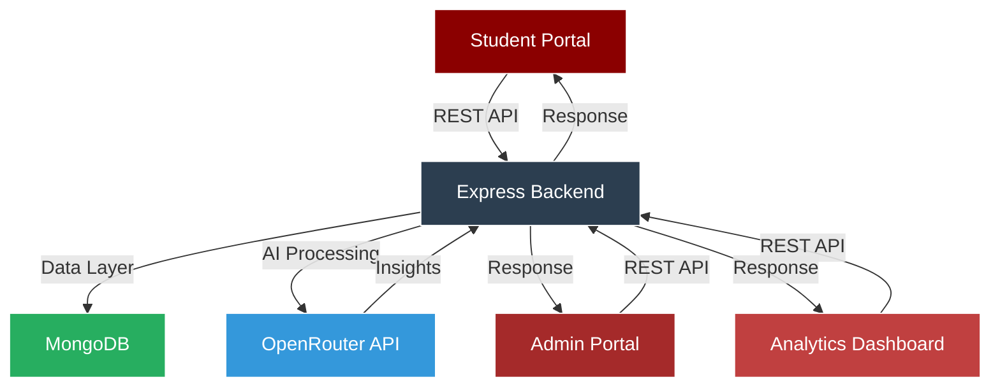

# Amrita Placement Tracker

<div align="center">


### **Next-Generation Campus Placement Management System**

*Structures placement tracking of Amrita Vishwa Vidyapeetham with AI-powered insights and analytics*

---


</div>

## Overview

**Amrita Placement Tracker** is a full-stack placement management ecosystem built to redefine how campus recruitment is monitored and optimized at Amrita Vishwa Vidyapeetham. Engineered for the Corporate and Industry Relations team (CIR) team and students of the university, the platform provides centralized tracking, intelligent automation, advanced analytics dashboards, and AI-driven insights — empowering data-backed strategies that significantly improve placement performance.

<details>
<summary><b>View System Architecture</b></summary>



</details>

---

## Key Capabilities

<table>
<tr>
<td width="50%">

### Student Experience
- **Smart Dashboard** - Real-time placement status and metrics
- **Drive Discovery** - AI-matched company opportunities
- **Application Tracking** - Multi-stage interview progress
- **Skill Analysis** - Gap identification and recommendations
- **Resource Hub** - Curated preparation materials
- **Alumni Insights** - Previous placement data and trends

</td>
<td width="50%">

### Administrative Control
- **Bulk Operations** - CSV/Excel student data import
- **Drive Management** - Company and eligibility configuration
- **Status Updates** - Real-time application and offer tracking
- **Analytics Engine** - Comprehensive placement statistics
- **Report Generation** - Exportable insights (JSON/CSV/PDF)
- **Announcement System** - Broadcast notifications

</td>
</tr>
</table>

---

## Feature Matrix

| Category | Features | Status |
|----------|----------|--------|
| **Authentication** | Role-based access (Student/Admin), JWT tokens, Session management |  |
| **Placement Tracking** | Drive listings, Application management, Interview rounds, Offer tracking |  |
| **AI Integration** | Readiness scoring, Skill gap analysis, Company matching, Resource recommendations |  |
| **Analytics** | Department stats, CTC analysis, Placement trends, Exportable reports |  |
| **Data Management** | Bulk upload, Data validation, Export capabilities, Backup system |  |
| **UI/UX** | Responsive design, Dark mode, Animations, Professional theme |  |

---

## Technology Stack

<div align="center">

### Frontend Architecture


### Backend Infrastructure


### Data & Storage


</div>

---

## System Architecture

<details>
<summary><b>Component Breakdown</b></summary>

```
├── Frontend Layer    
│   ├── Student Portal
│   │   ├── Dashboard (Real-time stats, notifications)
│   │   ├── Drives (Browse, filter, apply)
│   │   ├── Applications (Track status, rounds)
│   │   ├── Profile (CGPA, skills, resume)
│   │   ├── Resources (Prep materials, guides)
│   │   └── Analytics (Personal insights)
│   │
│   ├── Admin Portal
│   │   ├── Dashboard (System overview, metrics)
│   │   ├── Students (Bulk upload, management)
│   │   ├── Drives (Create, edit, close)
│   │   ├── Applications (Review, update status)
│   │   ├── Analytics (Department, company stats)
│   │   └── Reports (Generate, export)
│   │
│   └── Shared Components
│       ├── Navigation
│       ├── Forms & Inputs
│       ├── Charts & Graphs
│       ├── Tables & Lists
│       └── Modals & Dialogs
│
├── Backend Layer
│   ├── Authentication Service
│   ├── Student Management
│   ├── Drive Management
│   ├── Application Processing
│   ├── Analytics Engine
│   ├── AI Integration
│   └── Report Generator
│
└── Data Layer
    ├── MongoDB (Mongoose Schema)
    ├── Validation schemas
    └── Backup mechanisms
```

</details>

---

## AI-Powered Features

The platform leverages **OpenRouter API** for intelligent insights:

<table>
<tr>
<td width="33%">

#### Readiness Scoring
- Multi-factor analysis (CGPA, skills, experience)
- Weighted scoring algorithm
- Trend-based predictions
- Actionable recommendations

</td>
<td width="33%">

#### Skill Gap Analysis
- Company requirement matching
- Competency assessment
- Learning path generation
- Resource mapping

</td>
<td width="33%">

#### Smart Matching
- Student-company compatibility
- Role suitability scoring
- Historical success patterns
- Personalized suggestions

</td>
</tr>
</table>

---

## Analytics Dashboard

<details>
<summary><b>Available Metrics & Reports</b></summary>

### Placement Statistics
- **Overall Rate**: Placed vs Total Students
- **Department Breakdown**: CSE, ECE, EEE, ME performance
- **Company Analysis**: Drives, offers, acceptance rates
- **Timeline View**: Month-wise placement trends

### Compensation Analysis
- **CTC Distribution**: Histogram and percentile views
- **Range Analysis**: Min, Max, Median, Average
- **Company Comparison**: Offer packages across companies
- **Department Benchmarks**: Average CTC by department

### Student Insights
- **CGPA Correlation**: Academic performance vs placement
- **Skill Mapping**: In-demand vs acquired skills
- **Application Success**: Conversion rates by stage
- **Interview Performance**: Round-wise success metrics

### Export Formats
- JSON (Raw data)
- CSV (Spreadsheet compatible)
- PDF (Formatted reports)
- Excel (Advanced analytics)

</details>

---

## Project Structure

```plaintext
APT/
├── client/                     # Frontend (React + Vite)
│   ├── public/                 # Static assets
│   ├── src/
│   │   ├── assets/             # Images and global resources
│   │   ├── components/         # Reusable UI components
│   │   │   ├── admin/          # Admin-specific components
│   │   │   ├── loading/        # Loading skeletons
│   │   │   ├── Navbar.jsx
│   │   │   └── ...
│   │   ├── context/            # Global state (AuthContext)
│   │   ├── pages/
│   │   │   ├── admin/          # Admin Views
│   │   │   │   ├── Dashboard.jsx
│   │   │   │   ├── AdminAnalytics.jsx
│   │   │   │   └── ...
│   │   │   ├── student/        # Student Views
│   │   │   │   ├── Dashboard.jsx
│   │   │   │   ├── PlacementDrives.jsx
│   │   │   │   ├── Profile.jsx
│   │   │   │   └── ...
│   │   │   ├── Home.jsx
│   │   │   ├── Login.jsx
│   │   │   └── Register.jsx
│   │   ├── tests/              # Frontend Unit Tests (Vitest)
│   │   │   ├── components/     # Component Tests
│   │   │   └── pages/          # Page/Integration Tests
│   │   ├── App.jsx             # Main Routing
│   │   └── main.jsx            # Entry point
│   ├── .env                    # Frontend environment variables
│   ├── package.json            # Frontend dependencies
│   ├── tailwind.config.js      # Styling configuration
│   └── vite.config.js          # Build & Test configuration
│
├── server/                     # Backend (Node.js + Express)
│   ├── controllers/            # Logic for handling requests
│   ├── models/                 # Mongoose Database Schemas
│   │   ├── User.js
│   │   ├── PlacementDrive.js
│   │   ├── Notification.js
│   │   ├── Application.js
│   │   └── ...
│   ├── routes/                 # API Route Definitions
│   │   ├── authRoutes.js
│   │   ├── studentRoutes.js
│   │   ├── adminRoutes.js
│   │   └── ...
│   ├── middleware/             # Auth & Error handling middleware
│   ├── tests/                  # Backend Tests
│   │   ├── jest/               # Jest Test Suite
│   │   │   ├── controllers/
│   │   │   ├── middleware/
│   │   │   ├── models/
│   │   │   └── services/
│   │   └── vitest/             # Vitest Test Suite (Alternative)
│   ├── .env                    # Backend environment variables
│   ├── jest.config.js          # Jest configurations
│   ├── vitest.config.js        # Vitest configurations
│   ├── package.json            # Backend dependencies
│   └── server.js               # Server entry point
│
├── .gitignore
├── README.md                   # Project Documentation
└── docker-compose.yml          # Container orchestration (optional)
```

---

## Testing Strategy

Comprehensive testing ensures application reliability, security, and performance.

### 🧪 Frontend Testing (Vitest + React Testing Library)
Located in `client/src/tests/`

- **Component Tests**: Verifies individual UI components (e.g., `Navbar`, `SkillProgress`, `CompanyLogo`).
- **Page Tests**: Tests full page interactions and flows (e.g., `Login`, `Register`).
- **Interaction Testing**: Simulates user events (clicks, inputs) using `@testing-library/user-event`.

**Run Frontend Tests:**
```bash
cd client
npm run test        # Run tests in watch mode
# OR
npm run test:vitest # Run tests once
```

### 🧬 Backend Testing (Jest + Supertest)
Located in `server/tests/`

- **Unit Tests**:
  - **Controllers**: Tests API endpoints logic (e.g., `authController`, `studentController`).
  - **Models**: Validates Mongoose schema rules and custom methods (e.g., `User.js`).
  - **Middleware**: Verifies authentication and error handling (e.g., `auth.js`).
- **Integration Tests**: Uses `supertest` to test API routes end-to-end.

**Run Backend Tests:**
```bash
cd server
npm run test:jest   # Run Jest test suite
# OR
npm run test:vitest # Run Vitest test suite
```

---

## Installation & Setup

### Prerequisites

```bash
Node.js >= 16.0.0
npm >= 8.0.0
MongoDB (Local or Atlas)
Git
```

### Quick Start

```bash
# Clone repository
git clone https://github.com/Team8-Synapse/APT.git
cd APT

# Install dependencies
npm run install:all

# Setup environment variables
cp server/.env.example server/.env
# Edit server/.env with your configuration

# Start development servers
npm run dev

# Application URLs
# Frontend: http://localhost:5173
# Backend:  http://localhost:5005
```

### Manual Setup

<details>
<summary><b>Step-by-Step Instructions</b></summary>

#### Backend Setup

```bash
cd server
npm install

# Create .env file
cat > .env << EOF
PORT=5005
NODE_ENV=development
JWT_SECRET=your-secret-key-here
JWT_EXPIRE=7d
MONGO_URI=your-mongodb-uri
OPENROUTER_API_KEY=your-openrouter-key
CORS_ORIGIN=http://localhost:5173
EOF

# Start backend
npm run start
```

#### Frontend Setup

```bash
cd client
npm install

# Create .env file
cat > .env << EOF
VITE_API_URL=http://localhost:5005/api
VITE_APP_NAME=Amrita Placement Tracker
EOF

# Start frontend
npm run dev
```

</details>

---

## API Documentation

### Authentication Endpoints

```http
POST   /api/auth/register        # Register new user
POST   /api/auth/login           # User login
GET    /api/auth/me              # Get current user
POST   /api/auth/logout          # Logout user
```

### Student Endpoints

```http
GET    /api/students             # Get all students (Admin)
GET    /api/students/:id         # Get student by ID
PUT    /api/students/:id         # Update student
DELETE /api/students/:id         # Delete student (Admin)
POST   /api/students/bulk        # Bulk upload (Admin)
GET    /api/students/stats       # Student statistics
```

### Drive Endpoints

```http
GET    /api/drives               # Get all drives
GET    /api/drives/:id           # Get drive by ID
POST   /api/drives               # Create drive (Admin)
PUT    /api/drives/:id           # Update drive (Admin)
DELETE /api/drives/:id           # Delete drive (Admin)
GET    /api/drives/eligible      # Get eligible drives (Student)
```

### Application Endpoints

```http
GET    /api/applications         # Get all applications
POST   /api/applications         # Apply to drive
PUT    /api/applications/:id     # Update application status
GET    /api/applications/student/:id  # Get student applications
GET    /api/applications/drive/:id    # Get drive applications
```

### Analytics Endpoints

```http
GET    /api/analytics/overview   # Overall statistics
GET    /api/analytics/department # Department-wise stats
GET    /api/analytics/company    # Company-wise stats
GET    /api/analytics/trends     # Placement trends
GET    /api/analytics/export     # Export reports
```

---

## Deployment Guide

### Production Build

```bash
# Build frontend
cd client
npm run build

# Build backend
cd server
npm run build

# Deploy to server
npm run deploy
```

### Environment Configuration

```env
# Production .env
NODE_ENV=production
PORT=5005
MONGO_URI=production-db-url
JWT_SECRET=strong-secret-key
OPENROUTER_API_KEY=production-key
ALLOWED_ORIGINS=https://placement.amrita.edu
```

---

## Contributing

We welcome contributions from the community!

<details>
<summary><b>Contribution Guidelines</b></summary>

1. **Fork** the repository
2. **Create** a feature branch (`git checkout -b feature/AmazingFeature`)
3. **Commit** your changes (`git commit -m 'Add some AmazingFeature'`)
4. **Push** to the branch (`git push origin feature/AmazingFeature`)
5. **Open** a Pull Request

### Code Review Process

- All PRs require review from maintainers
- Tests must pass
- Code must follow style guidelines
- Documentation must be updated

</details>

---

## Team

<div align="center">

**Developed by Team 8**

*Amrita Vishwa Vidyapeetham*

**Project Supervisor**: [Supervisor Name]  
**Academic Year**: 2025-2026  
**Course**: Final Year Project

### Contributors

[View All Contributors](https://github.com/Team8-Synapse/APT/graphs/contributors)

</div>

---

## License

This project is licensed under the **MIT License** - see the [LICENSE](LICENSE) file for details.

---

## Support & Contact

For support, email: support@placement.amrita.edu

<div align="center">

### Quick Links

[Documentation](docs/) • [Issues](https://github.com/your-org/amrita-placement-tracker/issues) • [Discussions](https://github.com/your-org/amrita-placement-tracker/discussions)

---

**Built with precision. Powered by innovation. Designed for success.**


**© 2026 Amrita Placement Tracker | Team 8**

</div>
