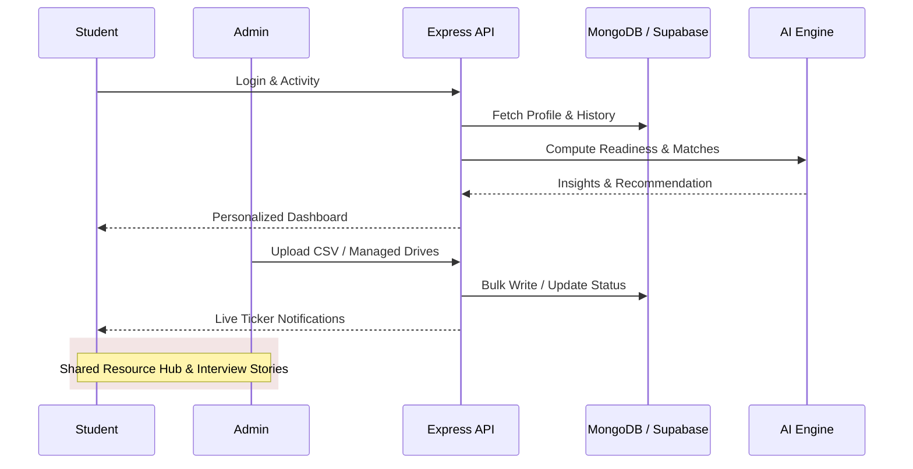

# Amrita Placement Tracker
<p align="center">

</p>

<div align="center">


### **Next-Generation Campus Placement Management System**

*Streamlining placement tracking with AI-enhanced insights, real-time analytics, and collaborative peer stories*

[Features](#features) • [Tech Stack](#tech-stack) • [System Flow](#system-flow) • [Installation](#installation) • [API Guide](#api-documentation) • [Future Roadmap](#road-map)

---


</div>

## 📌 Overview

**Amrita Placement Tracker (APT)** is an enterprise-grade, full-stack ecosystem designed to optimize campus recruitment at Amrita Vishwa Vidyapeetham. It provides a bridge between the **Career & Internship Readiness (CIR)** team, students, and alumni, delivering centralized tracking, deep behavioral analytics, and AI-driven growth metrics.

### 🌟 Why APT?
- **AI-Enhanced Readiness**: Proprietary scoring algorithm mapping CGPA and skills to industry requirements.
- **Storytelling Hub**: Students share and learn from real-world interview experiences.
- **Enterprise-Scale Dashboards**: High-fidelity metrics for institutional oversight.
- **Real-Time Synergy**: Live tickers, instant notifications, and dynamic scheduling.

---

## 📸 Visual Showcase

<details>
<summary><b>Click to view Dashboard Screenshots</b></summary>
<br>

| Student Dashboard | Admin Analytics |
|-------------------|-----------------|
|  |  |

| Placement Drives | Interview Stories |
|------------------|-------------------|
|  |  |

</details>

---

## 🏗️ System Architecture & Flow

<details open>
<summary><b>View System Interaction</b></summary>



</details>

---

## 🚀 Key Capabilities

<table>
<tr>
<td width="50%">

### 🎓 Student Ecosystem
- **Dynamic Dashboard**: Personalized placement funnel and metric visualization.
- **Interview Stories**: Access and contribute to a database of real interview experiences.
- **AI Growth Path**: Skill gap analysis and tailored preparation recommendations.
- **Prep Hub**: Curated materials for technical and aptitude rounds.
- **Calendar Sync**: Integrated schedule for drives and mock rounds.
- **Alumni Connect**: Insights from successfully placed seniors.

</td>
<td width="50%">

### 🛡️ Administrative Portal
- **Operational Oversight**: Total visibility into student readiness and offer conversion.
- **Drive Engine**: Create and manage multi-stage recruitment drives seamlessly.
- **Advanced Reports**: Export deep-dive analytics in PDF, CSV, and Excel formats.
- **Ticker Manager**: Broadcast urgent updates to the student community instantly.
- **Student Directory**: Robust management with bulk upload and data validation.
- **Interactive Ticker**: Manage live scrolling status updates.

</td>
</tr>
</table>

---

## 🛠️ Technology Stack

<div align="center">

| Core | Technologies |
|------|--------------|
| **Frontend** |     |
| **Backend** |    |
| **Data** |   |
| **Testing** |   |

</div>

---

## 📂 Project Structure

```plaintext
APT/
├── client/                     # Frontend Application
│   ├── src/
│   │   ├── components/         # Atomic UI & Layout components
│   │   ├── context/            # Auth, Theme, & Global State
│   │   ├── pages/
│   │   │   ├── admin/          # High-fidelity Admin Views
│   │   │   └── student/        # Personalized Student Views
│   │   ├── services/           # API Abstraction & AI Utils
│   │   └── App.jsx             # Route Guarding & Orchestration
│   └── public/                 # Static Assets & Global Styles
│
├── server/                     # Backend Logic
│   ├── controllers/            # Business Logic & Data Handling
│   ├── models/                 # Mongoose Data Schemas (13 Entities)
│   ├── routes/                 # Express API Definitions (15 Routes)
│   ├── services/               # Internal AI & Cloud Integration
│   └── data/                   # Seed Scripts & Raw Data
└── README.md                   # System Documentation
```

---

## 📡 API Documentation

APT exposes a robust REST API for cross-platform integration.

| Resource | Methods | Endpoint | Description |
|----------|---------|----------|-------------|
| **Auth** | `POST` | `/api/auth/login` | Session creation with JWT |
| **User** | `GET` | `/api/auth/me` | Current profile retrieval |
| **Student**| `GET` | `/api/student/dashboard` | Main student metric hub |
| **Drives** | `POST`| `/api/admin/drive` | Create drive (Restricted) |
| **Stories**| `POST`| `/api/experiences` | Share interview story |
| **Ticker** | `PUT` | `/api/ticker/:id`| Toggle live message status |
| **Analytics**|`GET`| `/api/reports/analytics`| Fetch system-wide metrics |

---

## ⚙️ Installation & Setup

### 1. Prerequisites
- **Node.js**: v16.0 or higher
- **Database**: MongoDB Atlas instance
- **Cloud Storage**: Supabase account (for file uploads)

### 2. Quick Start
```bash
git clone https://github.com/Team8-Synapse/APT.git
cd APT

# Install and build all environments
npm run install:all
```

### 3. Environment Config
Place a `.env` in the `/server` directory:

| Variable | Description |
|----------|-------------|
| `PORT` | Server listening port (default: 5005) |
| `MONGODB_URI` | MongoDB Atlas Connection String |
| `JWT_SECRET` | Secret key for signing tokens |
| `SUPABASE_URL` | Endpoint for Supabase storage |
| `SUPABASE_SERVICE_KEY` | Admin key for file operations |

### 4. Launch
```bash
# Production Launch
cd server && npm start

# Development with Hot-Reload
cd client && npm run dev
```

---

## 🔮 Future Roadmap

- [ ] **Mobile Application**: Native mobile app for iOS and Android.
- [ ] **Resume Parsing**: AI-based auto-filling of profile data from PDFs.
- [ ] **Mock Tests**: Integrating code compile for technical mock tests.
- [ ] **Chatbot**: AI assistant for resolving student FAQs.

---


## 🤝 Team & Contribution

## 🤝 Team 8 - SYNAPSE

| Roll No. | Name | GitHub |
|----------|------|--------|
| **CB.SC.U4CSE23601** | Adithyaraman R | [](https://github.com/ADITHYARAMAN7) |
| **CB.SC.U4CSE23621** | Harini N | [](https://github.com/harininr) |
| **CB.SC.U4CSE23633** | Meera J Vaishnav | [](https://github.com/Meerajvaishnav) |
| **CB.SC.U4CSE23657** | Vijay Aditya R V | [](https://github.com/VIJAYADITYARV) |
| **CB.SC.U4CSE23665** | Sharumathi P S | [](https://github.com/Sharumathips) |

*Amrita Vishwa Vidyapeetham, Coimbatore*

We welcome community feedback and contributions! Please read our [Contribution Guidelines](CONTRIBUTING.md) before submitting Pull Requests.

---

**© 2026 Amrita Placement Tracker | Built for Excellence**


